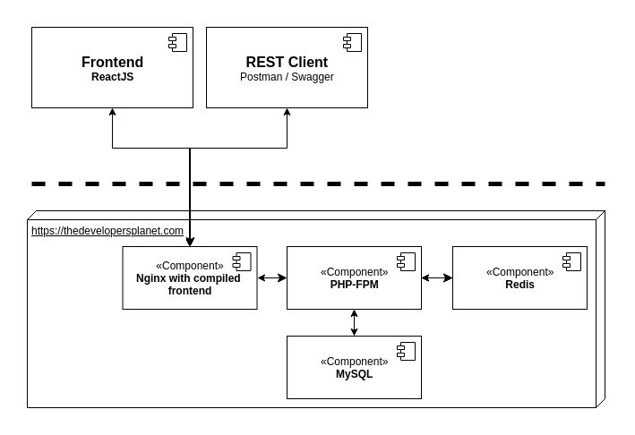

# dPlanet

- [dPlanet](#dplanet)
  * [Prerequisites](#prerequisites)
  * [Getting started](#getting-started)
  * [Known quirks](#known-quirks)
  * [Workflow](#workflow)
    + [Pull requests](#pull-requests)
    + [Infrastructure](#infrastructure)
    + [Deployment](#deployment)
    + [Https in development](#https-in-development)
    + [Style fixer](#style-fixer)
    + [PhpStan](#phpstan)
    + [PhpMyAdmin](#phpmyadmin)

A simple social media website to enhance your development skills.

// TODO: Expand description

## Prerequisites

In order to run this application in an isolated environment and to make installing it
easier, all you need is Docker. It's also advisable to have Make installed to
make use of the makefile.

## Getting started

Setting up the application is as easy as:
1. `git clone` the application and navigate to the project's directory
2. Run `make up` to start the application in development mode
3. Go to [localhost](https://localhost) to see the application, this might take some time 

Additionally you can also use `make fixtures` to generate test data and clear
the database. The **frontend** is running on [localhost](https://localhost) and the backend is running on 
[localhost/api](https://localhost/api).

## Known quirks

- Everything is still very WIP

## Workflow

We currently do not yet possess a Scrum/Kanban board to keep track of our progress, this is partially due to the size
of our development team. We hope in the future to start utilizing such a progress tracker. For now, we keep our
discussions in our Discord. 

Our main branch is the master, which houses our current production code and is automatically deployed to production. 
This branch is on lockdown and can only be edited with pull requests. The develop branch contains the code that is expected
to be deployed to production in the next release, you will typically find new features and recent bugfixes in this branch.
This branch automatically deploys to the test server. The develop branch is merged into the master branch during a deployment
to kick off the deployment process. All feature and bugfix branches are expected to be merged into the develop branch 
through a pull request.

### Pull requests

To ensure quality of our codebase, all new features and bugfixes have to go through a code review process. This is
typically done through a pull request. Please make sure the branch you're merging has a feature/ or bugfix/ prefix and
make sure it passed the build checks set in place. Also, please give a minimal summary on your changes.

### Checklist

In order to ensure quality and consistency in this codebase, a few checks must be made before adding in any new code.
Please consider these our code standards:
- Every PHP method **must** have an associated docblock (make sure you use types like `Developer[]`) if possible
- Every PHP method **should** have type hints *unless* it created need for overloading OR vendor code gets in the way
- Every PHP property **must** have a one-line docblock determining its type
- All PHP code **should** be tested, preferably with functional tests
- All PHP code **should** be php-stan tested with `make php.stan`
- All javascript helper functions **must** contain a docblock with associated typehints

Rules may be subject to change in the future.

### Tests

#### Backend

The backend tests are executed with PHPUnit, these tests are divided into three test suites: **Functional tests**, **Integration
tests** and **Unit tests**. 

**Unit tests** usually test individual methods in classes and any dependencies are mocked to see if the proper
methods are called or the correct output is returned. **Integration tests** go a step further and throw together multiple
components to see how they work together. Finally, **Functional tests** test the entire application and actually assembles
the framework together. These tests are all executed in the pipeline and you are expected to write them along with new features.

We strive to keep our test coverage above 90%.

#### Frontend

There is no test framework set up yet for the frontend.

#### E2E tests

We do not have any e2e tests yet.

### Infrastructure

Our infrastructure consists of a single-server setup with an Nginx handling requets from the internet. This Nginx contains
the built ReactJS files and is connected to the php-fpm container that processes PHP requests. The Symfony framework handles
this request in our scripts and talks to a MySQL database and a Redis database after it produces a result.

### Deployment

The **master** branch automatically deploys to our production server, the **develop** branch to the test server. For
this reason both of these branches are locked down and can only be changed with pull requests.

### Https in development

When you first open the homepage your browser will most likely alarm you that you're visiting an insecure page, this is completely
normal and you can ignore the warning. 

### Style fixer

All PHP code in this repository **must** be PSR compliant, to make this requirement
easy to achieve you can run the command `make php.fix` to fix all your php code. It is
also advisable to install php-cs-fixer in your IDE.

Prettier is also installed and can be invoked with `make js.fix`.

### PhpStan

To check if your php code is properly structured and does not contain easy-to-miss bugs
we have set up PhpStan for you. You can run this checker by using `make php.stan`

### PhpMyAdmin

In development phpmyadmin is running over at `http://localhost:8000`, you can
use this interface to directly view the data in the database.

**Credentials:**  
username: `dplanet`  
password: `development`  
